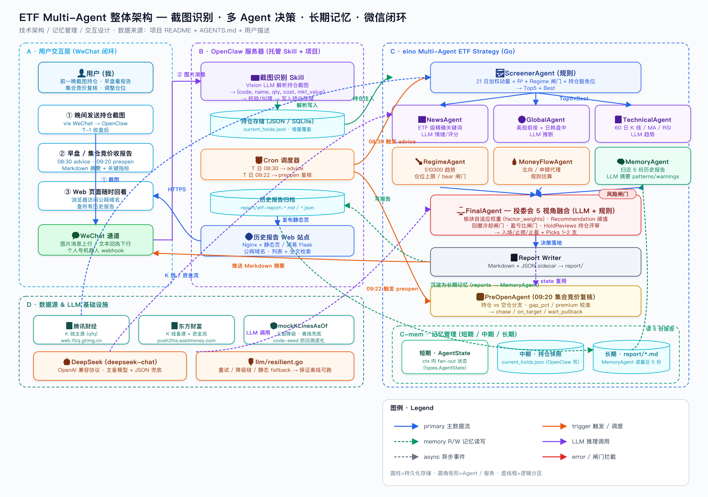

# Eino Multi-Agent ETF Strategy

A 股 ETF 开盘前多 Agent 分析系统。基于 [eino](https://github.com/cloudwego/eino) multi-agent 编排思想构建：以"21 日加权动量轮动"作为核心打分器，叠加技术面、消息面、宏观、资金面、跨境联动 5 路 Agent，并通过 MemoryAgent 注入长期记忆；最后由 FinalAgent 模拟一场"投资委员会"加权融合，输出**次日开盘前的交易决策**（标的 / 入场价 / 止损 / 止盈 / 仓位上限），并从 Top5 中精选 1~2 支推荐买入。

LLM 统一使用 **DeepSeek (deepseek-chat)**，通过 OpenAI 兼容协议调用；具备**主备模型 + 静态 JSON 兜底**的三级降级能力，离线 / 网络故障也能跑出规则版决策。

---

## 项目最终效果（截图识别 · Cron 调度 · 长期记忆 · 微信闭环）

下图是把"用户 → 微信 → OpenClaw 服务器 → eino Multi-Agent → 历史报告 Web 站"串起来的完整架构与数据流：



整套链路按"**T-1 晚上喂持仓 → T 日 08:30 出 advice → T 日 09:22 集合竞价复核 → 推送回微信 + 沉淀长期记忆**"运转，已落地的关键能力：

- **A · 用户交互层（WeChat 闭环）**：T-1 收盘后我用微信把券商持仓截图发给个人号机器人；T 日 08:30 收到 Markdown 摘要 + 关键指标；09:20 集合竞价收到复核；任意时刻可在浏览器访问公网历史报告页全文检索回看。
- **B · OpenClaw 服务器（托管 Skill + 项目）**：
  - **截图识别 Skill**：Vision LLM 解析持仓截图 → `{code, name, qty, cost, mkt_value}` → 校验 / 纠错 → 写入 `current_holds.json`（增量覆盖），全程不要求用户手动录入；
  - **Cron 调度器**：T 日 `08:30 → advice`、`09:22 → preopen` 复核两条定时任务，自动把 `current_holds.json` 注入为 `--current-hold a,b,c` 参数；
  - **历史报告 Web 站**：Nginx + 静态页 + 简易 Flask 列表与全文检索，承载 `report/etf-report-*.md` 与 `*.json` sidecar。
- **C · eino Multi-Agent ETF Strategy（本仓库）**：ScreenerAgent（21 日加权动量 + R² + Regime 闸门 + 持仓豁免位）→ News / Global / Tech / Regime / MoneyFlow / Memory 6 路 fan-out → FinalAgent 投委会 5 视角融合（板块自适应权重 + Recommendation 阈值 + 回撤冷却闸门 + 盈亏比闸门 + HoldReviews 持仓评审）→ Report Writer 落地 Markdown + JSON sidecar；09:20 由 PreOpenAgent 用 `gap_pct / premium` 校准 `chase / on_target / wait_pullback`。
- **C-mem · 三层记忆管理**：
  - 短期 = `types.AgentState`（fan-out 上下文）
  - 中期 = `current_holds.json`（OpenClaw 写、advice / preopen 读）
  - 长期 = `report/*.md`（MemoryAgent 读最近 5 份摘要为 patterns / warnings）
- **D · 数据源 & LLM 基础设施**：腾讯财经 K 线主源（qfq）+ 东方财富备源 / 资金流，LLM 走 DeepSeek (deepseek-chat) OpenAI 兼容协议，并由 `llm/resilient.go` 完成"重试 / 降级链 / 静态 fallback"——保证在网络抖动 / 模型限流时也能离线跑出规则版决策。

> 配套 Cron 表达式参考（OpenClaw 上托管，自动注入持仓参数）：
>
> ```cron
> # T 日 08:30 → 出当日 advice 报告，附 T-1 晚上识别得到的持仓
> 30 8 * * 1-5  cd /opt/eino-muti-etf-strategy && go run . --current-hold "$(jq -r '.codes|join(",")' current_holds.json)" >> logs/advice.log 2>&1
>
> # T 日 09:22 → 集合竞价复核，区分「加仓 / 新开仓」两条路径
> 22 9 * * 1-5  cd /opt/eino-muti-etf-strategy && go run ./cmd/preopen --current-hold "$(jq -r '.codes|join(",")' current_holds.json)" >> logs/preopen.log 2>&1
> ```

整套闭环的设计前提与 [AGENTS.md](AGENTS.md) 第 2 条对齐：**advice 模式只在每天开盘前给一次信号，不做日内动态调整**——Cron 只承担"定时触发 + 持仓注入 + 推送回微信"，所有决策仍由 Multi-Agent 流水线一次性算清。

---

## 一、快速开始

### 1. 准备环境

- Go 1.21+
- DeepSeek API Key（项目内置默认值，可直接跑）；如需替换：

```bash
export DEEPSEEK_API_KEY=sk-xxxxxxxxxxxxxxxxxxxxxxxxxxxxxxxxxx
```

### 2. 一键出今日报告（默认 advice 模式）

```bash
go run .
```

输出：终端打印 + 自动落地 Markdown 报告到 `report/etf-report-YYYYMMDD-HHMMSS.md`。

### 3. 命令行参数

```bash
go run . [flags]
```

| Flag | 默认值 | 说明 |
|---|---|---|
| `--mode` | `advice` | 运行模式：`advice`（单次出报告） / `backtest`（历史回测） |
| `--date` | 当天 | 基准日期 `YYYY-MM-DD`，可用于复盘 / 跑指定交易日 |
| `--current-hold` | 空 | 可选：当前持仓 ETF 代码，**支持逗号分隔多持仓**（如 `159915,512660`）；用于报告"持仓对照"、Screener 持仓豁免位、FinalAgent 持仓评审、PreOpen 加仓 / 新开仓区分；**留空即跳过，系统不做任何本地持久化** |
| `--report-dir` | `report` | 报告输出目录（同时也是 MemoryAgent 读取历史报告的目录） |
| `--skip-report` | `false` | 仅打印结果，不落地 Markdown |
| `--bt-start` | 一年前 | 回测起始日（仅 backtest 模式） |
| `--bt-end` | `--date` 或今天 | 回测结束日 |
| `--bt-step` | `5` | 采样间隔（**状态化模式下已忽略**，保留兼容） |
| `--bt-hold` | `5` | 持有期（**状态化模式下已忽略**，由信号反转决定） |
| `--bt-max` | `60` | 最大样本数；`0` = 不限。**状态化模式下表示截尾交易日数** |
| `--bt-variant` | `both` | 回测变体：`v3`（多 Agent 主流程） / `v3v2`（叠加 V2 4 闸门） / `both`（A/B 对比） / `joinquant`（裸聚宽对照） |

### 4. 常用命令示例

```bash
# 出今天的开盘前决策
go run .

# 出明早 (5/26) 开盘前决策（K 线自动 clamp 到最近收盘日）
go run . --date 2026-05-26

# 复盘上周一
go run . --date 2026-05-18

# 报告输出到自定义目录（同时影响 MemoryAgent 读取的历史窗口）
go run . --date 2026-05-26 --report-dir ./tmp_report

# 给出"我手上是创业板 ETF"的持仓对照建议
go run . --current-hold 159915

# 多持仓场景：同时持有创业板 ETF 与军工 ETF，逐只给出对照与持仓评审
go run . --current-hold 159915,512660

# 历史回测：最近 60 个采样点，每个采样点持有 5 个交易日
go run . --mode backtest --bt-start 2025-12-01 --bt-end 2026-05-25 --bt-step 5 --bt-hold 5

# 仅打印不落地报告（CI / 调试场景）
go run . --skip-report
```

### 5. 测试 / 构建

```bash
go build ./...        # 编译全部包
go vet ./...          # 静态检查
go test ./...         # 单元测试（含 momentum_score / rotation / writer / resilient）
```

---

## 二、整体架构

### 2.1 编排流程图

```
                    ┌─────────────────┐
   start ─────▶     │  ScreenerAgent  │  21 日加权动量 + 60 日 K 线 + 归一化
                    └────────┬────────┘
                             │ Top5 + Best
                             ▼
                    ┌─────────────────┐
                    │   fan-out (6)   │
                    └─┬──┬──┬──┬──┬─┬─┘
        ┌─────────┐ ┌──────┐ ┌──────┐ ┌─────────┐ ┌──────────┐ ┌─────────┐
        │  News   │ │Global│ │ Tech │ │ Regime  │ │MoneyFlow │ │ Memory  │
        │ Top5    │ │(LLM) │ │ Top5 │ │ (规则)  │ │ (规则)   │ │ (LLM)   │
        │ (LLM)   │ │      │ │(LLM) │ │         │ │          │ │ 读5份报告│
        └─────────┘ └──────┘ └──────┘ └─────────┘ └──────────┘ └─────────┘
              │          │      │         │            │           │
              └──────────┴──┬───┴─────────┴────────────┴───────────┘
                            ▼
                    ┌─────────────────┐
                    │  FinalAgent     │  投委会 5 视角 + 6 路加权
                    │  (LLM + 规则)   │  入场/止损/止盈 + Picks 1~2 支
                    └────────┬────────┘
                             ▼
                          end + Markdown 报告
```

入口实现：[orchestrator/pipeline.go](orchestrator/pipeline.go) 的 `Pipeline.Run`，使用 `sync.WaitGroup` 实现 fan-out / fan-in，所有 Agent 共享 `*types.AgentState`。

### 2.2 各 Agent 职责

| Agent | 类型 | 输入 | 输出 | 数据来源 |
|---|---|---|---|---|
| **ScreenerAgent** | 规则 | 全部 ETF | Top5 + Best（含 60 日技术指标） | K 线（腾讯/东财） |
| **NewsAgent** | LLM | Top5 板块 + 真实新闻 | 每只 ETF 的情绪/评分/要点 | 东方财富搜索 + DeepSeek |
| **GlobalMarketAgent** | LLM | — | 美股前夜 + 日韩盘中传导 | DeepSeek |
| **TechnicalAgent** | LLM | Top5 60 日 K 线 + 指标 | 每只 ETF 的趋势/支撑压力/区间 | DeepSeek |
| **RegimeAgent** | 规则 | 510300 K 线 | 宏观趋势 / 仓位上限 | K 线（腾讯/东财） |
| **MoneyFlowAgent** | 规则 | Best 标的 K 线 | 北向 / 申赎 / 主力代理估算 | K 线（腾讯/东财） |
| **MemoryAgent** | LLM | report 目录最近 5 份报告 | 长期记忆备忘（pattern + warnings） | 本地 markdown 报告 |
| **FinalAgent** | LLM + 规则 | 上述全部 | 综合决策 + Picks 1~2 支 | DeepSeek |

> 子 Agent 角色定位均融入了知名交易员视角，FinalAgent 模拟一场内部投委会：
> - **NewsAgent**：彼得·林奇（实地调研）+ 查理·芒格（反向思考）
> - **TechnicalAgent**：杰西·利弗莫尔（趋势）+ 威廉·欧奈尔（CANSLIM 量价）
> - **GlobalMarketAgent**：斯坦利·德鲁肯米勒（宏观仓位）+ 瑞·达利欧（全天候）
> - **RegimeAgent**：达利欧 + 霍华德·马克斯（周期 / 风险定价）
> - **MoneyFlowAgent**：保罗·都铎·琼斯 + 马蒂·施瓦茨（资金流向 / 顺势）
> - **FinalAgent**（CIO）：巴菲特 + 索罗斯 + 利弗莫尔 + 达利欧 + 西蒙斯 五位委员

### 2.3 板块自适应权重

不同板块对应不同的因子相关性 profile，FinalAgent 严格按系统下发的权重做加权综合（不允许自行调整）。详见 [agent/factor_weights.go](agent/factor_weights.go)：

| 板块 | Quant | Tech | News | Global | Regime | Flow |
|---|---|---|---|---|---|---|
| 海外（纳指/日经/德国30） | 0.30 | 0.30 | 0.05 | 0.25 | 0.05 | 0.05 |
| 港股 | 0.30 | 0.25 | 0.10 | 0.15 | 0.10 | 0.10 |
| A 股科技/新能源 | 0.30 | 0.25 | 0.10 | 0.05 | 0.15 | 0.15 |
| 顺周期/宽基 | 0.30 | 0.25 | 0.05 | 0.05 | 0.20 | 0.15 |
| 贵金属/债券 | 0.25 | 0.20 | 0.05 | 0.20 | 0.20 | 0.10 |

**Recommendation 映射**（综合分阈值，已对齐聚宽口径，见 `agent/final.go:ruleRecommend`）：
- ≥ 70 → `strong_buy`
- ≥ 40 → `buy`     （归一化分数对应底层动量分 score > 0）
- ≥ 25 → `hold`
- < 25 → `avoid`

> 旧阈值 80/65/50 会让"动量弱正向 + 多因子中性"的标的被映射成 hold，在状态化每日回测里 = 平仓 → 频繁空仓。新阈值让动量正向标的稳定进 buy，对齐聚宽"rank[0] 直接持有"语义。

**反向约束**：
- `regime.trend == "risk_off"` → 强制 `avoid`（达利欧派一票否决，硬约束保留）
- `regime.trend == "bear"` → 降一档（`strong_buy / buy → hold`）
- `target.premium_pct ≥ +3%` → `strong_buy/buy` 强制降为 `hold`（巴菲特派一票否决追高，仅实时模式生效）
- `position_cap` 必须 ≤ regime 给的上限（详见 [docs/CHANGELOG-strategy.md](docs/CHANGELOG-strategy.md) 中"P0 ④ Regime PositionCap"）

### 2.4 长期记忆（MemoryAgent）

**目标**：让今日 CIO 看到过去几天的"投委会会议纪要"，发现连续追高 / 连续踏空 / 板块切换 / 评分中枢漂移 / 同标重复推荐等跨日 pattern。

**工作流**：
1. 默认扫描 `--report-dir`（默认 `report/`）下文件名匹配 `etf-report-*.md` 的历史报告；
2. 文件名内嵌 `YYYYMMDD-HHmmss`，字典序倒序后取最新 5 份；
3. 用正则提取每份报告的「日期 / 目标 ETF / 综合评分 / 建议 / 综合论证」并压缩 reasoning 到 ~120 字；
4. 用 LLM 综合输出 `MemorySummary{summary, patterns[], warnings[], memos[]}`；
5. 注入 `AgentState.Memory`，由 FinalAgent 的 system prompt 直接消费；
6. LLM 不可达时走规则兜底（连续看多 / 板块切换 / 3 日均值 / 重复推荐）。

实现：[agent/memory.go](agent/memory.go)。

### 2.5 投委会精选（Picks）

NewsAgent 与 TechnicalAgent 已扩展为对 Top5 进行批量分析，FinalAgent 在 system prompt 中收到完整的 `news_list` / `tech_list`，并被要求输出 1~2 支 `picks`：

- **Pick #1**：默认就是 Top1（best），但必须给出"它在 Top5 中胜出的具体理由"；
- **Pick #2**（可选）：板块或风格应与 Pick #1 不同，避免双倍下注同一风险因子；
- 当 Top5 除 best 外没有任何标的同时满足 `trend != down` 且 `sentiment != negative` 时，仅返回 1 支；
- LLM 未返回 picks 时由规则兜底（板块分散优先、剔除 negative 消息面 + down 趋势）。

输出渲染至 `FinalDecision.Picks`，可用于报告"投委会精选"小节。

### 2.6 多持仓感知 & 持仓评审（HoldReviews）

advice 模式下 `--current-hold` 现已支持**逗号分隔多持仓**（如 `159915,512660`）。整套流程对持仓的处理遵循"**只增加可见性，不抬分、不绕过过滤**"的原则：

- **Pipeline / 状态层**：[orchestrator/pipeline.go](orchestrator/pipeline.go) `Pipeline.CurrentHolds` → [types/types.go](types/types.go) `AgentState.CurrentHolds`，单值 `CurrentHold` 字段保留为 `CurrentHolds[0]` 的兼容快照。
- **Screener 持仓豁免位**：[agent/screener.go](agent/screener.go) `ScreenerAgent.CurrentHolds` 与 [agent/rotation.go](agent/rotation.go) `RotationParams.MustIncludeCodes` 联动 —— 持仓若**已通过 MinScore / 过热 / Regime 闸门**但被截到 TopN 之外，会按其客观分数追加在结果末尾；分数被剔除则不出现，不插队不抬分。`DedupBySector=true` 时也会单独保留命中持仓，避免被同板块更高分标的吃掉。新增 `ScoredETF.IsCurrentHold` 标记，CLI / 报告里以 `🟦持仓` 高亮。
- **多持仓对照**：[agent/rotation.go](agent/rotation.go) `BuildHoldAdvices` 为每只持仓单独生成 `HoldAdvice`，渲染至 `AgentState.HoldAdvices`；旧字段 `HoldAdvice` 仍写入第一只持仓，老报告 / 老 sidecar 兼容。
- **HoldReviews 持仓评审**：[types/types.go](types/types.go) 新增 `FinalDecision.HoldReviews []HoldReview`，由 FinalAgent / 规则兜底输出"keep / trim / rotate"三档客观建议，**不参与 Recommendation / Picks 计算**，避免持仓主观偏差污染主决策。CLI 终端会单独打印一段 `--- 持仓评审 (HoldReviews) ---`。

> 设计前提：advice 模式只在每天开盘前给一次信号，持仓信号的取舍由用户自己决定 → 系统给客观可解释的"是否还在 Top / 板块比较 / 消息面 + 技术面" 评审，不替用户决定换仓。

### 2.7 风险层：回撤冷却 & 盈亏比闸门

均集中在 [agent/final.go](agent/final.go)，遵守 AGENTS.md 第 7 条：**短线回撤不强制降档主信号**，避免 advice 模式频繁换手吃费率，只在"新开仓 / 集合竞价追入 / 加仓"路径上拦截。

| 闸门 | 函数 | 触发条件 | 主信号行为 | PreOpen 行为 |
|---|---|---|---|---|
| 回撤冷却 | `CapByPullbackCooldownForState` | 近 5 日高点回撤 ≥ 5% **且** 未收复 MA5 / 最近阴线半分位 | 持仓 / 未提供持仓 → 不降档，仅注入"【回撤冷却】"提示文案；候选中目标非持仓 → 提示"换仓目标短线未修复" | — |
| 回撤冷却（备选 Pick） | `CapByPullbackCooldown` | 同上 | 备选 Pick（`buildAltPick`）直接 `buy → hold`，避免分散下注同时追高 | — |
| 盈亏比闸门 | `CapByRiskReward` | `(take-entry) / (entry-stop) < 1.4` 或 entry/stop/take 结构无效 | 主信号注入"【盈亏比提示】"，**不降档** | `applyVerdictRule` 命中 → `chase / on_target` 自动降为 `wait_pullback`，`adj_entry=0`（硬拦截） |

> 失效场景：单边强趋势中 5 日 -5% 回撤 + MA5 失守可能是正常调整，AGENTS.md 第 1 条要求长样本回测后再加任何降档；当前实现已选择"提示而不降档"作为 trade-off。

### 2.8 集合竞价复核（PreOpen Agent）

`cmd/preopen/main.go` 的 8:50 复核流程已经接入持仓维度，用来区分"加仓"与"新开仓"两条路径：

- 新增 `--current-hold a,b,c` 入参；持仓集合通过 [types/types.go](types/types.go) `PreOpenAnalysis.CurrentHolds` 透传给规则与 LLM。
- 规则版判定（[agent/preopen.go](agent/preopen.go) `applyVerdictRule`）：
  - **持仓 + 低开 ≥ 1%** → `wait_pullback`，`adj_entry=0`（不加仓）；
  - **空仓 + 低开 ≥ 1%** → 仅当大盘 `gap_pct ≥ -0.3%`、`premium_pct ≤ +0.5%`、`gap_pct > -0.8%` 时才允许 `chase` 折价介入，否则视为弱势延续 `wait_pullback`；
  - 大盘 `gap_pct ≤ -0.8%` → `chase / on_target` 一并降级为 `wait_pullback`，持仓侧 `adj_entry=0`；
  - 盈亏比硬拦截：`CapByRiskReward(buy, adj_entry, adj_stop, adj_take)` 命中 → `wait_pullback`，note 区分"已持仓不加仓 / 空仓暂不追"。
- LLM 路径在 system prompt 中显式接收 `current_holds`，与规则版口径一致。
- 报告生成器 [report/preopen_writer.go](report/preopen_writer.go) 在头部追加"当前持仓"一行，保留可追溯性。

### 2.9 NewsAgent 关键词精确化

历史教训：**「煤炭 ETF」用板块词「能源」搜新闻，会把新能源 / 个股处罚 / 油气消息混进结果**，使 NewsAgent 情绪打分被噪声主导。

- [agent/news.go](agent/news.go) `buildNewsKeywords` 重写为「ETF 自身（代码 / 全名 / 去基金后缀）→ ETF 级精确词 → 板块同义词」三层；
- 新增 `etfNewsKeywordOverrides`（约 70 只 ETF 的精确词典）：黄金 → `黄金/COMEX黄金`，煤炭 → `动力煤/焦煤/秦皇岛港煤价/迎峰度夏`，恒生科技 → `恒生科技/南向资金` 等；
- `skipBroadSectorKeyword` 当 sector 属于「能源 / 科技 / 消费 / 材料 / 宽基」等过宽板块且已有精确词时，**主动剥离板块同义词**（板块词的副作用大于覆盖收益）；
- 单元测试 [agent/news_final_test.go](agent/news_final_test.go) 覆盖煤炭 ETF 用例，确保不再混入"能源"泛词。

---

## 三、动量打分器

### 3.1 核心动量公式

```
1. y = log(close[-21:])
2. x = arange(21);  weights = linspace(1, 2, 21)     # 越近权重越高
3. slope, intercept = polyfit(x, y, 1, w=weights)    # 加权线性回归
4. annualized = exp(slope × 250) - 1                 # 年化收益率
5. R² = 1 - Σw·(y-ŷ)² / Σw·(y-ȳ)²                    # 加权 R²
6. score = annualized × R²                           # 最终动量得分
```

实现：[indicator/momentum_score.go](indicator/momentum_score.go)。

### 3.2 过滤参数（已对齐聚宽口径）

| 参数 | 值 | 含义 |
|---|---|---|
| `m_days` | 21 | 动量参考天数 |
| `max_score` | 6 | 过热阈值，超过需要日间 1.1× 加速门槛 |
| `min_score` | **0** | 下限。**已从 -1 调整为 0**，对齐聚宽 `g.min_score=0`，剔除负分动量 |
| `score_threshold_multiplier` | 1.1 | 过热标的的日间增长门槛 |
| `dedup_by_sector` | **false** | **板块去重默认关闭**，对齐聚宽（不去重）；可显式 `Screener.DedupBySector=true` 开启 |

### 3.3 Action 五态语义

由 [`RotationCandidate.Action()`](agent/rotation.go) 给出，**完全无状态**（不依赖本地持仓）：

| Action | 含义 | 触发条件 |
|---|---|---|
| 🚀 `strong_buy` | 强烈买入（动量加速） | `score_T ≥ score_{T-1} × 1.1` |
| ✅ `buy` | 买入（动量向上 / 反转） | `score_T > score_{T-1}` 或 `prev≤0 且 score>0` |
| ⏸ `hold_only` | 观望（动量减速） | `score_T ≤ score_{T-1}` |
| ❌ `avoid` | 回避（趋势失效） | `score < 0` 或 `R² < 0.3` |

---

## 四、数据源

详细见 [datasource/eastmoney.go](datasource/eastmoney.go)。**三级降级**保证可用性：

```
1. 腾讯财经 web.ifzq.gtimg.cn  ← 主源（前复权 qfq，本机环境最稳定）
       ↓ 失败
2. 东方财富 push2his.eastmoney.com  ← 备源（fqt=1 前复权）
       ↓ 失败
3. mockKLinesAsOf  ← 离线兜底（含 code seed，避免回测退化）
```

主源 URL 范例：

```
https://web.ifzq.gtimg.cn/appstock/app/fqkline/get?param=sh518880,day,,2026-05-25,22,qfq
```

ETF 池查询走东方财富 `push2.eastmoney.com/api/qt/clist/get`；失败时回退到内置 ETF 池。

---

## 五、目录结构

```
eino-muti-etf-strategy/
├── main.go                         # CLI 入口（advice / backtest 模式）
├── orchestrator/
│   └── pipeline.go                 # 多 Agent 编排（fan-out/fan-in）
├── agent/
│   ├── screener.go                 # 量化筛选（轮动 + 技术指标 + 归一化 + 持仓豁免位）
│   ├── rotation.go                 # 21 日加权动量 + Action 语义 + MustIncludeCodes / BuildHoldAdvices
│   ├── technical.go                # 技术面 LLM Agent（Top5 批量）
│   ├── news.go                     # 消息面 LLM Agent（Top5 批量 + ETF 级精确关键词）
│   ├── global.go                   # 跨境联动 LLM Agent
│   ├── regime.go                   # 宏观环境 (510300 趋势/仓位上限)
│   ├── moneyflow.go                # 资金面代理估算
│   ├── memory.go                   # 长期记忆 Agent（读 report/ 最近 5 份）
│   ├── final.go                    # 投委会决策融合 + 回撤冷却 / 盈亏比闸门 / HoldReviews
│   ├── preopen.go                  # 8:50 集合竞价复核（持仓 vs 新开仓 verdict）
│   ├── factor_weights.go           # 板块自适应权重 + 因子相关性提示
│   └── common.go                   # 共享：callLLMJSON / weightedScore / Cap
├── cmd/
│   └── preopen/main.go             # 集合竞价复核 CLI（--current-hold 支持多持仓）
├── indicator/
│   ├── momentum_score.go           # 21 日加权动量得分
│   └── indicator.go                # MA / RSI / MACD / Volatility 等
├── datasource/
│   └── eastmoney.go                # K 线 + ETF 池 (腾讯/东财/mock)
├── llm/
│   ├── client.go                   # LLM 客户端接口
│   ├── deepseek.go                 # DeepSeek (OpenAI 兼容协议)
│   ├── factory.go                  # 配置 → 客户端
│   └── resilient.go                # 主备 + 静态 fallback
├── backtest/
│   └── engine.go                   # 历史胜率回测 (规则版决策)
├── report/
│   ├── writer.go                   # Markdown 报告生成器
│   └── etf-report-*.md             # 已生成的报告（同时是 MemoryAgent 的输入）
├── config/
│   └── config.go                   # 配置 (LLM 主备 / API Key / 模型名)
├── types/
│   └── types.go                    # 共享类型 (AgentState / KLine / ETF / FinalPick / MemorySummary ...)
├── go.mod
└── README.md
```

---

## 六、典型输出示例

### 6.1 Advice 模式（终端）

```
=== A 股 ETF 开盘前多 Agent 分析 ===
基准日期: 2026-05-25 (回测/复盘模式)
[pipeline] step1: screener running…
[pipeline] step1 done. best=卫星产业ETF(159218) score=95.23
[pipeline] step2: news / global / technical / regime / moneyflow / memory fan-out…
[pipeline] step2 done.
[pipeline] step3: final agent aggregating…
[pipeline] step3 done. recommendation=buy score=68.00

--- Top5 候选 ---
1) 卫星产业ETF(159218) sector=军工 score=95.23 action=buy ...
2) 德国30ETF(513030) sector=海外 score=87.89 action=strong_buy ...
...

=== 最终交易决策 ===
综合评分: 68.00
建议: buy
入场: 6.240  止损: 6.100  止盈: 6.500
理由: ① 整体逻辑 ... ② 关键风险 ... ③ 操作要点 ...

📄 Markdown 报告已生成: report/etf-report-20260525-195335.md
```

### 6.2 Backtest 模式

回测引擎已升级为**状态化每日回测**：每个交易日跑一次信号，与昨日持仓一致 → 持有；否则换仓（扣双边费率）；区间末强制平仓。提供 4 个 variant：

```bash
# v3：本项目主流程多 Agent 决策
go run . --mode=backtest --bt-start=2026-01-01 --bt-end=2026-06-09 --bt-variant=v3 --bt-max=0

# joinquant：裸聚宽对照模式（旁路所有外围装饰，纯动量满仓）
go run . --mode=backtest --bt-start=2026-01-01 --bt-end=2026-06-09 --bt-variant=joinquant --bt-max=0

# both：v3 vs v3v2（叠加 V2 4 道闸门）A/B 对比
go run . --mode=backtest --bt-start=2026-01-01 --bt-end=2026-06-09 --bt-variant=both --bt-max=0
```

输出 Markdown 报告含 12+ 个风险/基准/费率指标：胜率、Sharpe、Sortino、Calmar、Profit Factor、最大回撤、年化收益、Alpha vs 510300 等。完整指标定义见 [docs/CHANGELOG-strategy.md#p0-3-回测引擎补齐风险基准费率指标](docs/CHANGELOG-strategy.md)。

```
样本=39 实际建仓=39 胜率=41.03% 平均加权收益=+0.79% Sharpe=0.96
📄 回测报告已生成: report/backtest-v3-20260609-170937.md
```

---

## 七、策略演进路线（P0~P5）

详细的改动追溯、文件 diff、实测对比、学术依据见 **[docs/CHANGELOG-strategy.md](docs/CHANGELOG-strategy.md)**。当前进度：

| 阶段 | 改造 | 难度 | 预期 Alpha 增量 | 状态 |
|---|---|---|---|---|
| **P0** | 应用必改 4 项对齐聚宽口径（dedupBySector / MinScore=0 / ruleRecommend 阈值 / PositionCap 仓位档位） | 低 | +20%（已验证）| ✅ 已实施 |
| **P1** | 加 252 日绝对动量过滤（双动量 Antonacci 2014） | 低 | +5% ~ +10%，回撤改善 | ⏳ 待实施 |
| **P2** | `score / σ_21` 凸性调整（防动量崩溃，Daniel & Moskowitz 2016） | 中 | Sharpe +0.2 ~ +0.3 | ⏳ 待实施 |
| **P3** | 波动率目标定仓替换 PositionCap（Harvey et al. 2018） | 中 | MDD 减半 | ⏳ 待实施 |
| **P4** | 残差动量（剥离 510300 β，Blitz et al. 2011） | 中 | 横截面排名更准 | ⏳ 待实施 |
| **P5** | ML 多因子 + IPCA（Gu, Kelly, Xiu 2020 / Kelly, Pruitt, Su 2019） | 高 | 长周期 Sharpe +0.5 | 💭 思考中 |

---

## 八、扩展与注意事项

1. **K 线无缓存**：单次 advice 约 65~70 个 HTTP 请求，回测约几千个。如需密集回测，建议在 `datasource` 层加文件缓存（按 `code+date` 落 JSON）。

2. **News / Global 是 LLM 推断**：跑"未来日期"模式时，News / Global Agent 给出的是 LLM 基于训练数据 + 真实新闻搜索的合理推断，**不是真实未来行情**。Screener / Tech / Regime / MoneyFlow 仍基于真实 K 线，可信度高。

3. **持仓信息无状态**：`--current-hold` 只在本次会话使用，**不写入任何文件 / 不持久化**，符合"用户不存持仓"的设计前提。

4. **长期记忆窗口可调**：MemoryAgent 默认读 `--report-dir` 下最近 5 份历史报告；窗口大小可在代码里调整 `MemoryAgent.MemoryWindow`，目录可调整 `MemoryAgent.MemoryDir`。回测期间若不希望被历史报告影响，可临时把 `--report-dir` 指向一个空目录。

5. **eino 框架接入**：当前 `orchestrator/pipeline.go` 用 `sync.WaitGroup` 模拟 `compose.Graph` 的 fan-out/fan-in 行为；如需切换到真正的 eino，按其 graph DSL 重写 `Pipeline.Run` 即可，Agent 接口已经收敛成 `Run(ctx) (*Result, error)` 形式。

---

## 九、免责声明

本项目仅用于研究 / 学习多 Agent 编排与量化策略组合，**报告内容不构成投资建议**，请勿用于实盘决策。
